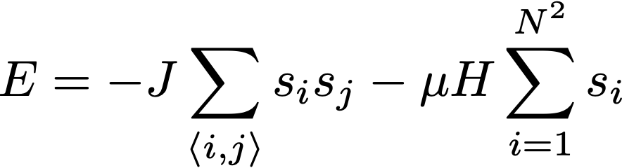

## The Ising Model of a Ferromagnet

#### Background
In his 1924 PhD thesis, Ising erroneously predicted – based on his
investigation into the one-dimensional model – that there were no phase
transitions for any lattice dimension *d* with temperature *T* \> 0.
However, it has since been shown that abrupt phase transitions occur for
lattices with dimensions *d* ≥ 2. In 1944, Lars Onsager published his
proof for the two-dimensional Ising model, containing his analytical
result for the critical temperature for an infinite lattice
$$\\frac{k\_{B} T\_{c}}{J} = \\frac{2}{\\ln(1+\\sqrt{2})} = 2.269185\\ldots$$

#### Definition of the Ising Model
Consider *N* × *N* sites on a two-dimensional square lattice where each
site is occupied by a spin *s**i* =  ± 1 where the positive
and negative correspond to spin-up and spin-down respectively. The
energy of the system is then given by

Here $\\expval{i,j}$ runs over the nearest-neighbours, *J* is the
exchange energy, *μ* is the magnetic moment and *H* is the external
field. The regime where *J* \> 0 corresponds to ferromagnetism, since
the spins favour alignment. There is therefore a ‘competition’ between
the exchange energy *J* trying to align the spins and the thermal energy
*k**B**T* trying to randomise the spins. To simplify the
problem[1], we set *J* = *k**B* = 1. In order to avoid edge
effects, the two-dimensional square lattice is mapped onto a torus
**T**2 = *S*1 × *S*1 by imposing
suitable periodic boundary conditions.

[1] Thus *T* is measured in units of *J*/*k**B*.